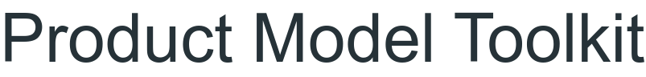
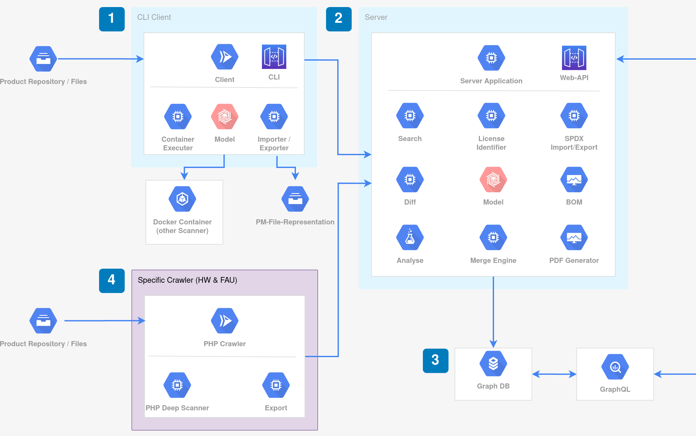

<!--
SPDX-FileCopyrightText: 2020 Friedrich-Alexander University Erlangen-Nürnberg (FAU)

SPDX-License-Identifier: CC-BY-SA-4.0
-->

<p align="center"></p>

Product Model Toolkit for Managing Open Source Dependencies in Products


[](https://goreportcard.com/report/github.com/osrgroup/product-model-toolkit)
[](https://codebeat.co/projects/github-com-osrgroup-product-model-toolkit-master)
[](go.mod)

[](https://opensource.org/licenses/Apache-2.0)

## Introduction

The Product Model Toolkit helps you to manage third-party open source dependencies in your product. The toolkit itself is not a license scanner. Instead, it facilitates other license scanners to incorporate license and other information together with architectural information into a unified model.

## Architecture Overview



1. The small CLI client shall facilitate already existing scanners. For that, it will start Docker container which itself contains the actual scanner and its dependencies. The result then will be sent to the server application or stored as a file for further use. This should help to compare the developed PHP specific deep scanner with other tools.

2. The server application contains all functionalities needed to generate a software bill-of-materials (SBOM) of a product, represented by the elements in the figure. It is also responsible for storing a component graph into a database.

3. A database optimized for graphs shall store the data. The DB shall provide a GraphQL interface, or allows to add a GraphQL interface to it.

4. The PHP scanner performs a deep analysis of a web project and sends its result as a standardized representation (like the CLI client) to the server.

## How to use it ?

- run `docker-compose up -d` in docker directory
- run `run-server.sh` script. The server and a postgres instance will be ready in a second.
- copy the required input file to the server container. For this, use the following line:
    - `docker cp <input-file> pmt_server:/<input-file>`
- run the required command according to the help command of cli or even `scenario.sh` file

if you don't want to use Docker, then there is also another option.
All important commands needed to build, test, and run the applications are represented as Makefile rule.
All available rules can be displayed with `make help`.

## Project Structure

```
├── cmd/.................Main applications of this project which will be compiled as executables
│   ├── client/
│   │   └── cli.go......Client application entry point
│   └── server/
│       └── main.go......Server application entry point
├── docs/................Documentation
├── docker/..............Dockerfiles
│   ├── graphile/........PostGraphile
│   └── scanner/.........Scanner tools 
├── pkg/.................Library code for client and server
├── model/...............The model for representing a software product
└── README.md
```

### Build

Build with `make build` the client and server application. The generated artifacts are `pmtserver` and `pmtclient`.

### Test

Test with `make test`. This also produces a code coverage report as a file called `coverage.out`.

### Run

Already built executable can be executed directly. For example `./pmtclient` or `./pmtserver`.

During development, `go run cmd/client/main.go` or `go run cmd/server/main.go` can be used to run a specific application.

Run client and server with `-h` as argument to show all available arguments.

#### Perform Scan with Client

To list all available scanner execute `./pmtclient -l`

Example call: `./pmtclient [-s SCANNER] -i [PROJECT_DIR_TO_SCAN]`

Scan with specific scanner: `./pmtclient -s Licensee -i ~/workspace/myProject`

Scan with default scanner: `./pmtclient -i ~/workspace/myProject`

If you run the client without arguments `./pmtclient` it will use the default scanner and scan the current working directory.

## API (Server)

### General Info

When you start the server it will show you all available REST endpoints.

Base path: `http://[hostname]:[port]/api/v1`

| Method | Path                      | Description                           |
|--------|---------------------------|---------------------------------------|
| GET    | /                         | Get all routes                        |
| GET    | /version                  | Get version of server                 |
| GET    | /health                   | Check if server is available          |
| GET    | /products                 | Get all stored products               |
| GET    | /products/:id             | Get a product by its ID               |
| POST   | /products/import          | Import a product from scanner results |
| POST   | /scanner                  | Scan with different scanners          |
| POST   | /products/export          | Import a product from scanner results |
| POST   | /spdx/search              | Search product components             |


### Simple UI routes

Base path: `http://[hostname]:[port]`

| Method | Path                      | Description                           |
|--------|---------------------------|---------------------------------------|
| GET    | /                         | Get index page                        |
| GET    | /products                 | Get all products page                 |
| GET    | /find-product-by-id       | Get a product by id                   |
| POST   | /import                   | Import a product from scanner results |

### API Documentation

You can find the [Insomnia](https://insomnia.rest/download) import file on docs folder.

## License Crawler

PHP: [product-model-php-plugin](https://github.com/hallowelt/product-model-php-plugin)

## Project description

This project includes these functionalities:

<!-- Here you can find the functional requirements for the toolkit. We strive to implement these features in an agile fashion. -->

### BOM Generation

- The system shall generate BOM artifacts as SDPX document.
- The system shall generate BOM artifacts as human readable representation.
- The system will be able to provide BOM information for custom reports.

### SPDX support

- The system shall import the component graph from a SPDX document.
- The system shall export the component graph as SPDX document.
- The system shall import licence information from a SPDX document.

### Diff

- The system shall validate if two component graphs are the same.
- The system shall validate if two components are the same.
- The system shall present the difference in components between two component graphs of the same product.
- The system shall present the difference in meta-data between two component graphs of the same product.

### Search

- The system shall be able to search for components by its name.
- The system shall be able to search for components by its meta-data.

### Data Merging

- The system should merge license information from different sources into a SDPX license identifier representation.
- The system should merge sub component graphs into the component graph.

### Client Crawler

- The crawler should be executable in a CI environment.
- The crawler shall be able to facilitate other scanners running in Docker containers to collect license information.
- The crawler shall send scanned information to the server application via HTTP calls (REST).
- The crawler shall store scanned information as structured representation (SPDX, SBOM, etc.) as files.

## Development

### Add license and copyright header

If you have installed the [REUSE Tool](https://github.com/fsfe/reuse-tool) you execute the following commands to add the correct header to the files.

```shell
# For source code use
$ reuse addheader --copyright "Friedrich-Alexander University Erlangen-Nürnberg (FAU)" --license Apache-2.0 myFile.go

# For documentation and media files use
$ reuse addheader --copyright "Friedrich-Alexander University Erlangen-Nürnberg (FAU)" --license CC-BY-SA-4.0 myImage.png

# For configuration and data files use
$ reuse addheader --copyright "Friedrich-Alexander University Erlangen-Nürnberg (FAU)" --license CC0-1.0 myConfig.cfg
```

## License

Copyright 2020 Friedrich-Alexander University Erlangen-Nürnberg (FAU)

This work (source code) is licensed under [Apache-2.0](./LICENSES/Apache-2.0.txt).

Files other than source code are licensed as follows:

- Configuration and data files are licensed under [CC0-1.0](./LICENSES/CC0-1.0.txt).

- Documentation is licensed under [CC BY-SA 4.0](./LICENSES/CC-BY-SA-4.0.txt).

See the [LICENSES](./LICENSES/) folder in the root of this project for license details.
