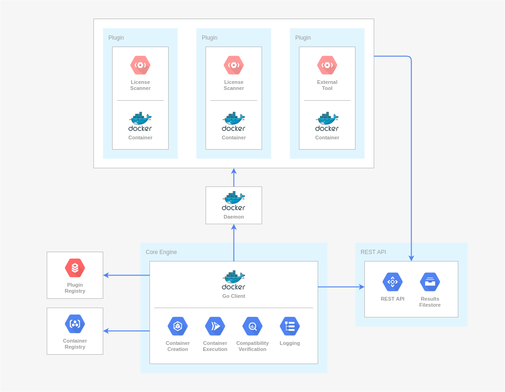

<!--
SPDX-FileCopyrightText: 2021 Cristian Mogildea

SPDX-License-Identifier: CC-BY-SA-4.0
-->

## Introduction

This package implements the plugin architecture for the client application as part of an ongoing master thesis at the Professorship for Open Source Software at the Friedrich-Alexander-University Erlangen-Nuremberg. The goal is to provide a universal approach that facilitates the integration of scanner tools, which are defined as plugins.

## Architecture Overview

## Requirements

### Authenticating to GitHub Packages

The plugin engine retrieves Docker container images from *GitHub Packages*, whereas authentication is necessary to load publicly available packages. For this purpose, a personal access token with scope *read:packages* has to be created (see this [doc guide](https://docs.github.com/en/free-pro-team@latest/github/authenticating-to-github/creating-a-personal-access-token) for details) and the following environment variables have to be set before the program starts:

- `DOCKER_USER` GitHub username used to generate the token
- `DOCKER_TOKEN` generated token

As for *GitHub Actions* workflow, `GITHUB_TOKEN` is used and no further action is necessary.